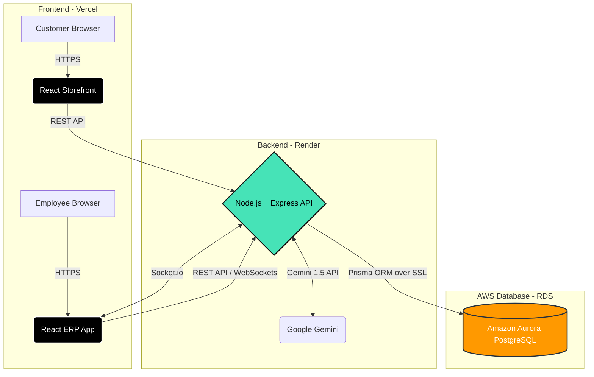

# AWS Hackathon Submission Guide

Follow this guide step-by-step to submit your project to Devpost. All the text and scripts you need are provided below.

---

## Step 1: Text Description (Copy & Paste to Devpost)

**Which AWS Database did you use?**
> "For ForgeOS, we utilized **Amazon Aurora PostgreSQL** (Serverless v2) via AWS RDS. Aurora serves as the central nervous system of our manufacturing ERP. We chose Aurora PostgreSQL because our application requires intense, ACID-compliant relational data modeling across 14 normalized tables (Sales, Purchasing, Manufacturing, HR, and Inventory). Aurora's auto-scaling capabilities ensure that our complex Make-to-Order (MTO) transaction logic—which automatically drafts manufacturing and purchase orders based on live stock calculations—never bottlenecks during high-traffic storefront sales events."

---

## Step 2: Architecture Diagram

You need to provide an architecture diagram. You can use the one I created below. I highly recommend taking a screenshot of this diagram and uploading it as an image to your submission!

---

## Step 3: The 3-Minute Video Script (YouTube)

Use this script to record your video. Keep a brisk pace, and share your screen while you talk!

**[0:00 - 0:30] The Problem & Solution (Talking Head or Slides)**
> "Hi, welcome to ForgeOS. Manufacturing SMEs lose 15-20% of their revenue due to fragmented tools like Excel and WhatsApp causing stockouts and production delays. We built ForgeOS to solve this: a B2B manufacturing ERP with a core automation engine that connects secondary B2C storefronts directly to the B2B factory floor."

**[0:30 - 1:45] The Demo (Screen Share)**
> *(Show the Storefront)* "Here is our customer storefront deployed on Vercel. A customer places an order for a dining table."
> *(Switch to ERP - Sales Tab)* "Instantly, over WebSockets, the order appears in the ERP. Let's confirm the order." 
> *(Click Confirm)* "The system instantly checks our physical stock. Because we don't have enough, ForgeOS automatically triggers a Make-to-Order (MTO) event, drafting a Manufacturing Order for the exact shortfall."
> *(Show AI Assistant)* "Finally, as a bonus, our Gemini AI reads the live database, allowing managers to ask questions in plain English like 'What products are low on stock?' and get instant operational reports."

**[1:45 - 2:30] AWS Database Explanation (Screen Share AWS Console or Diagram)**
> "To power this complex automation engine, we chose **Amazon Aurora PostgreSQL**. Because a single customer checkout triggers cascading inventory reservations and manufacturing orders, we needed strict ACID compliance and high-performance relational mapping across 14 tables. Aurora's serverless auto-scaling guarantees our factory operations remain lightning-fast, even during massive spikes in B2C storefront traffic."

---

## Step 4: The Vercel Links & Screenshot

1. **Vercel Project Links:**
   - ERP: `https://forgeos-erp.vercel.app/`
   - Storefront: `https://forgeos-store.vercel.app/`
2. **Vercel Team ID:** *(You can find this in your Vercel Dashboard -> Settings -> General -> Team ID)*
3. **AWS Screenshot:** Log into your AWS Console, search for "RDS" or "Aurora", go to your databases, and take a screenshot showing your active PostgreSQL cluster. Upload this to Devpost!

---

## Step 5: Bonus Points (LinkedIn Post)

To get the bonus points, publish this exact text on LinkedIn, and make sure it is set to "Public"! (Feel free to attach your YouTube video or a screenshot of the app).

> I just built a full-stack B2B Manufacturing ERP called ForgeOS! 🚀
> 
> Manufacturing SMEs are stuck using Excel and WhatsApp to manage their factory floors. ForgeOS solves this via a core automation engine that instantly converts secondary B2C sales into Make-to-Order pipelines on the B2B factory floor.
> 
> To handle the complex relational logic and cascading transaction events, I utilized **Amazon Aurora PostgreSQL** via AWS RDS, connected to a Node.js backend and a Vercel frontend. Aurora's serverless scaling was perfect for ensuring zero bottlenecks during high-traffic sales events!
> 
> I created this piece of content for the purposes of entering the H0 Hackathon! Check it out! #H0Hackathon #AWS #Vercel #PostgreSQL #SaaS

---

## Step 6: Project Story (Copy & Paste to Devpost)

### Inspiration
Manufacturing SMEs ($1M–$50M in revenue) are the backbone of the global supply chain, yet they are historically underserved by technology. During our research, we found that factory managers rely heavily on fragmented spreadsheets, WhatsApp messages, and whiteboards to track inventory and production. This disconnect often leads to a **15–20% loss in revenue** due to stockouts, miscommunication, and delayed procurement. 

We wanted to build a B2B Business Operating System that completely eliminates these silos. We envisioned a unified platform where a customer clicking "Buy" on a storefront would instantly and autonomously orchestrate the entire factory floor's logistics.

### What it does
ForgeOS is a full-stack, automated B2B ERP designed for manufacturing. The core of ForgeOS is its real-time **Automation Engine**. 

When a secondary B2C storefront generates a sale, ForgeOS processes the order instantly. If physical inventory is insufficient, the engine intelligently triggers a **Make-to-Order (MTO)** pipeline, automatically drafting Manufacturing Orders and Purchase Orders for the exact raw materials required. 

To complement this, ForgeOS features:
*   **6-Role Access Control:** Segmented dashboards for Admin, Sales, Purchase, Manufacturing, Inventory, and HR.
*   **Global WebSocket Sync:** Every action on the factory floor live-syncs across all browsers without page refreshes.
*   **Forge AI:** An integrated Google Gemini assistant that queries live database metrics to generate plain-English operational reports for managers.

### How we built it
We engineered ForgeOS using a Micro-SaaS architecture to ensure production-grade scalability:
*   **Database:** We utilized **Amazon Aurora PostgreSQL (AWS RDS)**. Because our automation engine relies on cascading database transactions (deducting stock, reserving inventory, and creating multiple order variants simultaneously), we heavily relied on Aurora's robust ACID compliance and relational mapping across 14 tables.
*   **Backend:** A Node.js + Express.js REST API hosted on Render, handling complex procurement mathematics and Socket.io broadcasts.
*   **Frontend:** We used React and Vite, utilizing Vercel to host both the B2B ERP Application and the B2C Storefront.
*   **ORM:** Prisma was used to enforce strict database typing and migrations.

### Challenges we ran into
Building a live-syncing automation engine across two entirely different frontend clients (Storefront and ERP) introduced major cloud networking challenges. Initially, strict CORS policies across our Vercel and Render environments blocked WebSocket handshakes, leading to dropped connections. We had to completely re-engineer our Socket.io middleware to handle wildcard origins and strip restrictive credentials, allowing the "slow lane" (HTTP Polling) to successfully execute when "fast lane" WebSockets were blocked by cloud load balancers.

Furthermore, calculating exact stock shortages dynamically (taking into account already-reserved stock versus true free-to-use stock) required complex database transactions. Ensuring this math was mathematically perfect without introducing race conditions during high-traffic checkouts was a significant hurdle.

### Accomplishments that we're proud of
We are incredibly proud of the **MTO Automation Engine**. Watching a storefront checkout seamlessly cascade into the ERP, calculate material shortages, and auto-generate the exact factory work orders in less than a second is extremely satisfying. We successfully built a product that doesn't just display data—it actively manages a business.

### What we learned
We learned the sheer power of **Amazon Aurora** when paired with a modern Node.js backend. The ability to trust the database layer to handle highly complex, atomic transactions allowed us to focus our development time on the business logic rather than worrying about data corruption. We also gained immense experience in WebSocket architecture and cloud-native networking.

### What's next for ForgeOS
In the future, we plan to implement direct IoT integrations for factory machines. We want ForgeOS to not only track Manufacturing Orders but to connect directly to assembly line PLCs, feeding live machine uptime and defect rates directly into our AWS Aurora database for the AI assistant to analyze.
